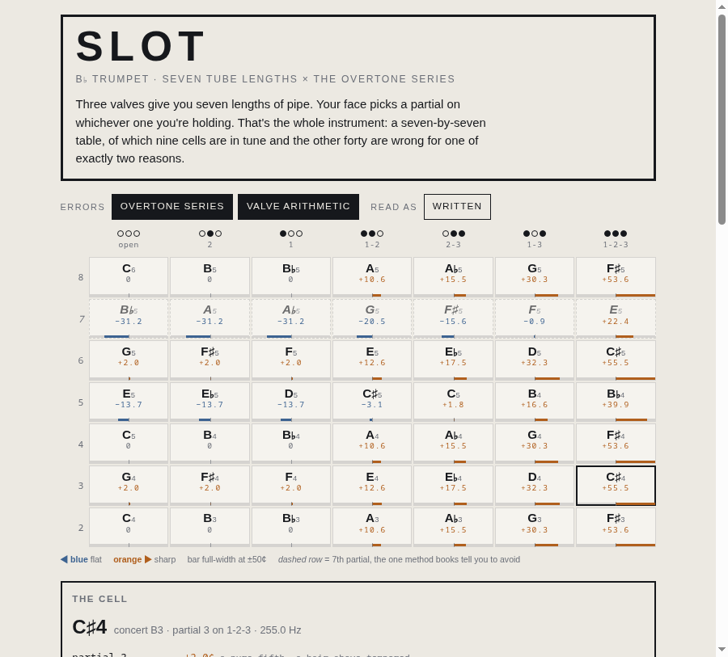

# slot

Every note a B♭ trumpet can play, laid out as the seven-by-seven table it actually is,
with the two independent errors that add up inside each cell. Built for someone a week
into a horn who has been told "low C♯ is sharp, kick the slide" and not told how far,
or why, or what it costs everywhere else.

**Status: shipping.** Nothing described here is unbuilt. What is missing is a
measurement: every number comes from tube lengths and none of it has been checked
against a real horn and a real tuner. See Weak spots for the experiment that would
settle it.

Open `index.html` in a browser and it runs. No build, no packages, no network. The
microphone needs a secure origin, so for the listening half:

```bash
python3 -m http.server 8000    # then http://localhost:8000
```



## Measured

Every figure below is derived from tube length and asserted twice, by two programs that
share no code: `tools/horn-check.mjs` builds the horn from scratch in node, and
`tools/checks.mjs` reads the same values back out of the running page. Reproduce with
`node tools/horn-check.mjs`.

Worst rows first. Valve slides are at the ideal cut, all the way in. The throw is the
third-valve ring except on 1-2, which has no valve 3 in it and has to be corrected with
the first-valve saddle instead.

| Fingering | Written | Cents sharp | Throw to true it |
|---|---|---|---|
| partial 3, 1-2-3 | C♯4 | +55.51 | 32.91 mm (1.30 in) |
| partial 3, 1-3 | D4 | +32.27 | 18.18 mm (0.72 in) |
| partial 2, 1-2-3 | F♯3 | +53.56 | 31.73 mm (1.25 in) |
| partial 2, 1-3 | G3 | +30.32 | 17.07 mm (0.67 in) |
| partial 2, 2-3 | A♭3 | +15.53 | 8.30 mm (0.33 in) |
| partial 2, 1-2 | A3 | +10.63 | 5.36 mm (0.21 in), first-valve slide |

Nine of the forty-nine cells are exactly in tune. The other forty are wrong, and the
error in each is the row's error plus the column's, with a residual under 10⁻¹² cents
across the whole table. That is an identity, not a fit.

Two numbers are worth more than the rest. The worst note on the instrument is written
C♯4 at +55.5 cents, a quarter tone and change. The closest to true, among cells where
both errors are live, is written F5 on the 7th partial with 1-3, at −0.86 cents: the
partial every method book tells you to avoid, cancelling the valve combination that is
furthest wrong.

The 18.18 mm and 32.91 mm throws are the falsifiable part. They are the three-quarters of
an inch and the inch-and-a-third that a teacher demonstrates by feel, arrived at here from the
length of the tubing alone.

## Usage

Three things it is for.

**Read the map.** The columns are the seven tube lengths in descending order, drawn as
the valves you press. The rows are the partials your lip picks. Color is deviation,
blue flat and orange sharp, with the bar underneath carrying the same number so color
is never the only channel. Tap any cell to hear what that fingering actually produces.

**Take one cell apart.** Select a cell and the inspector shows the addition: the
partial's error, the valve combination's error, and the sum, each with the reason it is
what it is. *Hear the error* plays the note you were aiming at, then the note the tube
gives you, then both at once. At 10 cents the pair beats. At 55 it is simply two
different notes.

**Check yourself against it.** Press *Listen* and play. The page reports which partial
and which slot you landed on, how far you are from where the tube sits, and how far you
are from the tempered note, plus a steadiness figure over the last second and a half
for long tones. The ear always measures against the real horn, whatever the display
toggles are set to.

## How it works

One model, in the `cell(partial, slot)` function, and everything drawn or sounded reads
from it.

A valve adds a fixed length of pipe cut for the open horn. Dropping a semitone requires
*multiplying* the tube by 2^(1/12). Those two facts are incompatible the moment you
press a second valve, because the horn you are adding to is no longer the horn the
slide was cut for:

```
valve 2  →  +5.95% of the open horn      one semitone,  exact alone
valve 1  →  +12.25%                      two semitones, exact alone
valve 3  →  +18.92%                      three,         exact alone

1 + 2    →  +18.19% where +18.92% was needed   →  10.63 cents sharp
1 + 2 + 3→  +37.11% where +41.42% was needed   →  53.56 cents sharp
```

The second error is unrelated and lives in the rows: partial 3 is a pure fifth (1.96
cents above tempered), partial 5 a pure major third (13.69 below), partial 7 the
septimal seventh (31.17 below). Because one error is a property of the column and the
other of the row, and cents are logarithms, a cell is exactly their sum.

That is also why the third-valve slide has a ring on it. Cutting valve 3 long trades
the error in 1-3 and 1-2-3 against slot 3 alone going flat, and the *maker's compromise*
preset shows the trade at a 3.2-semitone cut: 1-3 improves from +30.3 to +12.2 while
slot 3 alone falls to −20.0. No fixed length zeroes all three. The lever exists because
the arithmetic has no fixed solution.

Pitch detection is normalized autocorrelation over lags from 140 Hz to 1150 Hz, with a
parabolic fit on the winning lag and a first-peak-above-90%-of-maximum rule to stay off
the octave. Trumpets have a strong fundamental, so that rule is enough; it recovers a
tone with the fundamental removed entirely to within 0.01 Hz.

## Weak spots

**Nothing here has met a trumpet.** The model is derived end to end. It reproduces the
beginner's fingering chart and lands the slide throws in the range players are taught,
which is encouraging and is not evidence. The experiment that would settle it: put a
tuner on a King Cleveland 600, play written C♯4 with the slide fully in, and read the
deviation. The prediction is +55.5 cents against a horn whose valve 3 is cut ideally,
and less on a horn whose maker already cut it long. Set the cut slider until the page
agrees with the tuner; that slider position is then a measurement of your horn.

**The ideal cut is not what you own.** Nearly every trumpet built cuts valve 3 long.
The default here is the mathematically exact cut, chosen because it isolates the
arithmetic; it makes 1-3 and 1-2-3 look worse than your horn is.

**Equal temperament is assumed as the target.** A player in a section tunes to the
section, not to a grid, and will lip the 5th partial somewhere between its pure and
tempered positions depending on the chord. Every deviation printed here is against
12-tone equal temperament at A440 and says nothing about what is musically right.

**The mic is honest about pitch and silent about everything else.** No attack, no tone,
no air. It cannot tell a beautiful note from a dead one at the same frequency, and it
gives up below roughly 140 Hz, which excludes the pedal register entirely.

**Partial 7 is on the chart and shouldn't be played.** It is drawn dashed because the
table would lie by omission without it, not as a suggestion.

## Verification

Two suites, no CI. Both must be run by hand.

`node tools/horn-check.mjs` derives the horn independently of the page and asserts every
published number: the valve tubing lengths from two different routes, all seven column
errors, all seven row errors against their textbook interval values, the exact-addition
identity across all forty-nine cells, both slide throws, the 3.2-semitone compromise
row, the fact that no fixed cut tunes all three valve-3 slots, and eight spot-checks
against the printed fingering chart. Exit code 1 names the first disagreement and its
size.

`node tools/cdp.mjs http://localhost:8000/index.html $PWD/tools/checks.mjs` drives
headless Chrome and runs 55 checks in the live page: the lattice builds all 49 cells,
the toggles zero the layer they name, the written-to-concert transposition holds for
every cell, the slide corrects what it is pulled for and detunes what it shares, and
the audio graph builds. It also feeds synthetic tones straight into `detect()`
(a low C, a high C, a missing fundamental, silence, and noise), because headless Chrome
has no microphone. It then narrows the viewport to 360 by 740 and asserts that the page does
not scroll sideways, that the grid does, that the partial numbers stay pinned while it
scrolls, and that every cell is still a 44-pixel tap target. It reports any uncaught page
exception, which is how the `var history` collision that silently killed the whole
script was found.

What neither covers: any real horn, any real microphone, any browser but Chrome, and
whether the thing is pleasant to use.

## Files

- `index.html`, the whole instrument, no dependencies
- `tools/horn-check.mjs`, the independent derivation and the receipts
- `tools/checks.mjs`, what the running page must still be true about
- `tools/cdp.mjs`, headless Chrome driver, lifted from `spiral/tools/cdp.mjs`
