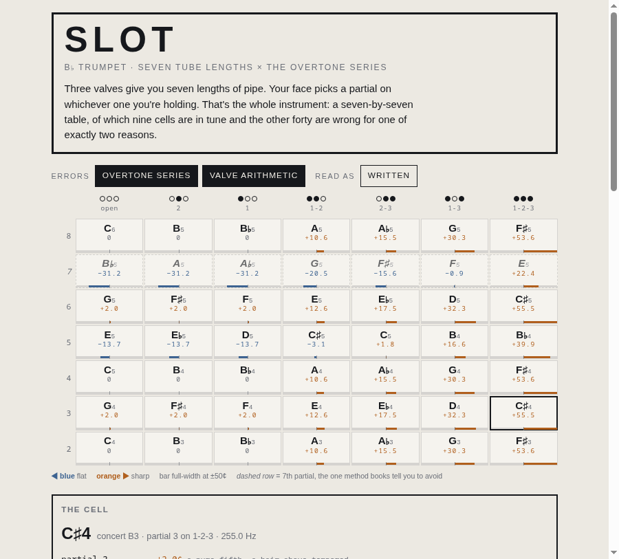

# slot

An interactive chart of B♭ trumpet fingerings that shows how sharp or flat each note plays and how far to pull a valve slide to fix the worst ones. Its 49 cells cross seven fingerings (the valves held down) with seven natural overtones, and a cell's error is the fingering's plus the overtone's. It is for a beginner who was told "low C♯ is sharp, kick the slide" and not how far or why. It is one dependency-free HTML file that plays each cell and listens through the microphone.

**Status: working.** Every figure on the chart comes from a model of the horn, and no one has checked them against a real horn with a tuner yet.

Live: https://ampactor.dev/slot/



## Quick start

Open `index.html` in a browser. The page has no dependencies and loads nothing over the network, so the chart works straight from the file. It opens with the worst note in the chart selected and its error broken down in the panel under the grid.

For the microphone, serve the folder over `localhost`, which browsers treat as a secure origin (the only kind they give a microphone to):

```bash
python3 -m http.server 8000    # then open http://localhost:8000
```

The live copy at https://ampactor.dev/slot/ uses HTTPS, which also counts.

## Usage

The page does three jobs, and a panel of controls sets up the horn it models.

**Read the map.** Each column is a fingering, running from open (the shortest tube) to all three valves down (the longest). The page and its code call a column a slot. Each row is a partial. The lips pick one of the natural overtones of whatever tube the valves make, and partial n vibrates at n times that tube's lowest frequency; together the partials form the harmonic series. Each cell is one note, named as written for B♭ trumpet, which is a whole step above the concert pitch that sounds (C4 is middle C). Under the name is the note's error in cents against 12-tone equal temperament. That is the standard tuning, with 12 equal semitones to the octave and the A above middle C at 440 Hz (A440). A cent is a hundredth of a semitone. Color shows the error, blue for flat and orange for sharp. The printed number and a bar at the foot of each cell repeat it, and the bar reaches the cell's edge at ±50 cents, so color is never the only channel. Tap a cell to hear what that fingering produces.

**Take one cell apart.** Select a cell and the panel under the grid shows the addition: the partial's error, the fingering's error and their sum, each with a one-line reason. *Hear the error* plays the note you were aiming at, then the note the tube gives you, then both together. At 10 cents apart the pair beats; at 55 it sounds like two different notes. For a sharp fingering that uses valve 3, the panel gives the slide throw. That is how far to push, or kick, the third-valve slide out with its finger ring to bring the note to pitch. *Kick the slide true* moves the slide there, and every other fingering that uses valve 3 moves with it.

**Check yourself against it.** Press *Listen* and play. The page names the partial and the slot you landed on. It shows how far you are from where the tube sits and from the tempered note. It also lights the matching cell, and a needle shows the distance from the tempered note. For long tones it adds a steadiness figure, the spread of your pitch over the last second and a half. The ear always measures against the full model with both errors on, whatever the display toggles are set to.

**The rig.** Sliders pull the third-valve slide out by up to 40 mm and the first-valve slide by up to 20 mm. A third slider sets how long valve 3's tubing is cut, measured as how many semitones it lowers the open horn, from 3.00 to 3.40. A cut of 3.00 is the ideal cut, and the page opens on the longer *Maker's compromise* preset of 3.20 (Limitations explains why). The other presets restore the ideal cut or push both slides back in. Two toggles turn the overtone error and the valve error off independently, and *Read as* switches the note names between written and concert pitch.

## How it works

One model in `index.html` feeds everything the page draws or plays. Its `cell()` function returns a cell's two errors, their sum, and the target and sounding frequencies. The model takes the open horn as 1473 mm of tubing (4 ft 10 in) with a fundamental of concert B♭2 (116.54 Hz). The rig's sliders and toggles change its inputs, and the grid, the panel, the sound and the ear all recompute from it.

A valve adds a fixed length of pipe, cut so that it alone lowers the open horn by exactly one, two or three semitones. Lowering a note by a semitone takes the whole tube *multiplied* by 2^(1/12). The two rules agree for one valve and disagree the moment a second valve goes down, because the horn being added to is no longer the horn the slide was cut for. That is the column error:

```
valve 2   →  +5.95% of the open horn      one semitone,  exact alone
valve 1   →  +12.25%                      two semitones, exact alone
valve 3   →  +18.92%                      three,         exact alone

1 + 2     →  +18.19% where +18.92% was needed   →  10.63 cents sharp
1 + 2 + 3 →  +37.11% where +41.42% was needed   →  53.56 cents sharp
```

The row error has an unrelated cause. The harmonic series lands on whole-number frequency ratios. Equal temperament steps by 2^(1/12), which lands on a whole-number ratio only at the octave. Partial 3 sits a pure fifth (3:2) above partial 2, which is 1.96 cents above the tempered fifth, and partial 6 repeats that error an octave up. Partial 5 is a pure major third (5:4) above partial 4, 13.69 cents flat of the tempered third. Partial 7 is the septimal seventh (7:4), 31.17 cents flat. Partials 2, 4 and 8 are octaves and exact.

Cents are logarithms of frequency ratios, so ratios that multiply add in cents. One error belongs to the column and the other to the row, so each cell's error is exactly their sum, with no parameters fitted. `tools/horn-check.mjs` compares that sum with a direct computation from frequencies, and the largest difference across the 49 cells is 1.1 × 10⁻¹² cents, which is floating-point rounding. Nine cells are exactly in tune: partials 2, 4 and 8 on the open horn, on valve 2 and on valve 1.

Cutting valve 3 long trades error in 1-3 and 1-2-3 against valve 3 alone going flat. At the maker's-compromise cut of 3.2 semitones, 1-3 improves from +30.3 to +12.2 cents and 1-2-3 from +53.6 to +36.2, while valve 3 alone plays 20.0 cents flat. The grid has no column for valve 3 alone, which aims at the same notes as 1-2; horn-check prints it in its cut sweep. No fixed length zeroes all three, so the third-valve slide has a finger ring and the player moves it. Moving it fixes one fingering and detunes the others that use valve 3: at the ideal cut, kicking written G3 true leaves the 2-3 fingering on the same partial 16.3 cents flat.

### The worst fingerings

The table shows written C♯4 and D4 on partial 3 and the four multi-valve fingerings on partial 2, at the ideal cut with the slides all the way in. The throw is for the third-valve slide, except on 1-2, which has no valve 3 and needs the first-valve slide instead.

| Fingering        | Written | Cents sharp | Throw to correct it                  |
| ---------------- | ------- | ----------- | ------------------------------------ |
| partial 3, 1-2-3 | C♯4     | +55.51      | 32.91 mm (1.30 in)                   |
| partial 3, 1-3   | D4      | +32.27      | 18.18 mm (0.72 in)                   |
| partial 2, 1-2-3 | F♯3     | +53.56      | 31.73 mm (1.25 in)                   |
| partial 2, 1-3   | G3      | +30.32      | 17.07 mm (0.67 in)                   |
| partial 2, 2-3   | A♭3     | +15.53      | 8.29 mm (0.33 in)                    |
| partial 2, 1-2   | A3      | +10.63      | 5.36 mm (0.21 in), first-valve slide |

`node tools/horn-check.mjs` derives these numbers from the tube lengths without importing anything from the page. `tools/checks.mjs` reads the same values back out of the running page, so two programs that share no code have to agree. Both assert every cents figure except D4's +32.27, which follows from the partial-3 row and the 1-3 column that both do assert. Both assert the throws for C♯4, D4, F♯3 and G3. The 2-3 and 1-2 throws come from the same formula, but neither program asserts them; horn-check prints them to one decimal.

The worst note in the chart is written C♯4 at +55.51 cents, slightly more than a quarter tone (50 cents), and 1-2-3 on partial 3 is its only fingering. The closest to true among cells where both errors are nonzero is written F5 on partial 7 with 1-3, at −0.86 cents. In that cell, the partial that method books tell players to avoid cancels the most out-of-tune two-valve fingering.

The 18.18 mm and 32.91 mm throws are the falsifiable part. They are the three quarters of an inch and the inch and a third that a teacher demonstrates by feel, and here they come from the length of the tubing alone.

### Sound and pitch detection

Each note plays through a small Web Audio synth: an oscillator with a custom wave of falling overtones, shaped by a low-pass filter and a short attack. The ear reads the microphone about 30 times a second and finds the pitch by normalized autocorrelation, which compares the signal with delayed copies of itself. It searches delays that cover about 140 Hz to 1150 Hz and ignores input that is too quiet or has no clear period. It takes the first peak that reaches 90% of the highest one, which keeps it on the right octave, and fits a parabola through that delay to refine the estimate. The rule relies on the trumpet's strong fundamental. In the page checks, a synthetic 261.63 Hz tone with its fundamental removed still comes back within 0.01 Hz (261.6299 Hz; the check allows ±1 Hz). The detected pitch then maps to the nearest of the 49 cells.

## Project layout

```
index.html             the whole app: model, grid, sound and pitch detection
tools/horn-check.mjs   the independent derivation, in Node
tools/checks.mjs       the checks the running page must pass
tools/cdp.mjs          a headless Chrome driver with no packages, taken from the spiral project
docs/img/              screenshots of the page, rewritten by every run of the page checks
```

## Deploy

The live copy at https://ampactor.dev/slot/ is a copy of `index.html` kept in the site's repository, [ampactor-labs.github.io](https://github.com/ampactor-labs/ampactor-labs.github.io), at `public/slot/index.html`. That repository deploys to GitHub Pages on every push to its main branch. A change here reaches the live page only when someone copies the new `index.html` over that file.

## Testing

There is no CI, and both suites run by hand. The first needs only Node:

```bash
node tools/horn-check.mjs
```

It rebuilds the horn without importing anything from the page. It asserts the valve tubing lengths by two routes (from length and from frequency), all seven column errors, and all seven row errors, three of them against their textbook interval values. It asserts that row plus column matches a direct computation in all 49 cells to within 10⁻⁹ cents. It also asserts the count of nine in-tune cells, the worst cell, the closest cancellation, the throws for C♯4, D4, F♯3 and G3, and the 3.2-semitone compromise. It checks that none of six cuts from 3.0 to 3.5 semitones tunes all three valve-3 fingerings to within 1 cent, and it spot-checks eight notes against the printed fingering chart. On success it prints its tables and `all checks pass.` and exits with status 0. On a mismatch it prints every failing check with the value it got and the value it wanted, then exits with status 1.

The second suite drives headless Chrome through the DevTools protocol. It needs Node 22 or newer, `google-chrome` on the PATH, and the server from Quick start running in the repository root:

```bash
node tools/cdp.mjs http://localhost:8000/index.html $PWD/tools/checks.mjs
```

It runs 56 checks in the live page. They check that the grid has 49 cells, that the page opens on the maker's-compromise cut, and that the published figures hold at the ideal cut. Others check that each toggle zeroes the layer it names, that written pitch sits two semitones above concert in every cell, and that the slide corrects the note it is pulled for and detunes the fingering it shares. The audio graph has to build, with sound muted. Headless Chrome has no microphone, so the suite feeds synthetic tones straight into `detect()`: a low C, a high C, a tone with its fundamental removed, silence, and noise. It then narrows the viewport to 360 by 740 pixels. There it checks that the page does not scroll sideways, that the grid does, that the partial numbers stay pinned while the grid scrolls, and that every cell is still at least 44 pixels tall. Any uncaught page exception fails the run, which is how a `var history` collision that had silently stopped the whole script was found. The run also rewrites the three screenshots in `docs/img/`.

Neither suite covers a real horn, a real microphone, any browser other than Chrome, or whether the page is pleasant to use.

## Limitations

**Nothing here has met a trumpet.** The model is derived end to end. It reproduces the beginner's fingering chart and lands the slide throws in the range players are taught, which is encouraging and is not evidence. The experiment that would settle it: put a tuner on a King Cleveland 600, play written C♯4 with the slide fully in, and read the deviation. The prediction is +55.5 cents against a horn whose valve 3 is cut ideally, +38.2 at the maker's-compromise cut the page opens on, and less still on a horn whose maker already cut it longer than that. Set the cut slider until the page agrees with the tuner; that slider position is then a measurement of your horn.

- **The ideal cut is not what you own.** Nearly every trumpet is built with valve 3 cut long, so the page opens on the maker's-compromise preset of 3.2 semitones, which is closer to a real horn before anyone has put a tuner on this one. The table under How it works stays at the ideal cut because that cut isolates the arithmetic, and the *Ideal cut* button reproduces it live. Neither preset is your horn. The calibration experiment above is what replaces both with a real number.
- **Equal temperament is the only target.** A player in a section tunes to the other players and bends the 5th partial with the lips to somewhere between its pure and tempered positions, depending on the chord. Every deviation printed here is against 12-tone equal temperament at A440 and says nothing about what is musically right.
- **The microphone measures pitch and nothing else.** It cannot tell a beautiful note from a dead one at the same frequency. It listens only between about 140 Hz and 1150 Hz, which covers the chart and leaves out the pedal tones below partial 2.
- **The slide advice is wrong for flat notes.** For a flat fingering that uses valve 3, such as partial 7 on 2-3, the panel says "Already true with the slide where it is." Pulling the slide only lengthens the tube, which lowers the note, so it cannot fix a flat one.
- **Partial 7 is on the chart and should not be played.** Method books tell players to avoid it, so the page draws it dashed. It stays because the table is incomplete without it.
- **The model is a generic horn.** It treats the horn's resonances as exact harmonics, which real horns only approximate, and the width and flare of a real horn's tubing shift the right slide positions by millimeters. It ignores air temperature, which also moves a real horn's pitch, and it leaves out the valve-3-alone fingering.

## License

No license chosen yet.
