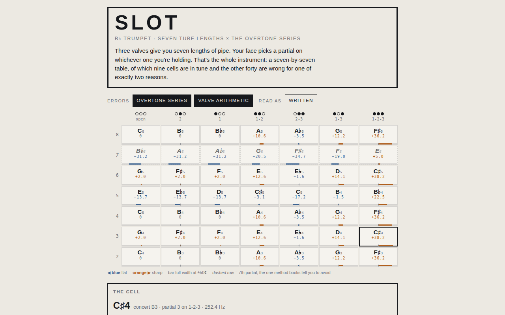

# slot

A web app that lays out every note a B♭ trumpet can play as a seven-by-seven table, with the two tuning errors that add up in each cell. It is for a beginner who has been told to pull a tuning slide out for a sharp low note, and not told how far or why. Every number comes from tube length, and a microphone mode shows which cell you played. It is one HTML file of plain JavaScript and the Web Audio API, with no dependencies or build step.

**Status: shipping.** The model has not been checked against a real horn and a tuner yet; Limitations describes the experiment that would settle it.

Live: https://ampactor.dev/slot/



## Quick start

```bash
git clone https://github.com/ampactor-labs/slot
cd slot
python3 -m http.server 8000
```

Open http://localhost:8000. You should see the table with written C♯4 selected (partial 3, all three valves down) at +38.2 cents. With the page's default valve-3 cut, that is the sharpest note on the horn, tied with C♯5 an octave up.

Opening `index.html` straight from disk also works, except for the microphone: browsers only allow microphone access on a secure origin such as `localhost`. There is nothing to install, and the page makes no network requests.

## Usage

A trumpet is a fixed length of tube, and the player's lips can only make it sound at its natural resonances. These are the partials. They sit at (nearly) whole-number multiples of the tube's lowest pitch, the fundamental, and are numbered 2, 3, 4 and up. The rows of the table are partials 2 to 8. Three valves each add a loop of tubing, which lowers every partial: valve 2 by one semitone, valve 1 by two and valve 3 by three. Their combinations give seven tube lengths, and the columns (the code calls them slots) are those seven from shortest to longest: open, 2, 1, 1-2, 2-3, 1-3 and 1-2-3. Every note on the horn is one partial on one slot.

Deviations are in cents, hundredths of a semitone, measured against 12-tone equal temperament (the piano's tuning) with the A above middle C at 440 Hz. A B♭ trumpet transposes: a written note sounds a whole tone lower, so written C4 is concert B♭3, the name a piano would give that pitch. The page shows written names, and the Written button switches to concert. Each valve loop has a U-shaped tuning slide. On most trumpets the first and third slides have a saddle or ring so the left hand can pull them out while playing, which lengthens the tube and lowers a sharp note. Players call this kicking the slide, and this README calls the distance pulled the throw.

**Read the map.** Color is deviation, blue for flat and orange for sharp. Each cell also prints its number, and a bar along its bottom edge shows the size (full width at 50 cents), so color is never the only signal. The 7th-partial row is dashed. Tap any cell to hear what that fingering produces. The *Overtone series* and *Valve arithmetic* buttons switch either error off, so you can see which one moves which cells.

**Take one cell apart.** Select a cell and the inspector shows the addition: the partial's error, the valve combination's error, and their sum, each with the reason it is what it is. *Hear the error* plays the note you were aiming at, then the note the tube gives you, then both at once. At 10 cents the pair beats, a slow pulse in volume. At 55 cents they sound like two different notes.

**Change the horn.** Sliders pull the third-valve slide (0 to 40 mm) and the first-valve slide (0 to 20 mm), and set how long valve 3 is cut (3.00 to 3.40 semitones). The presets are *Ideal cut*, *Maker's compromise* and *Slides in*. *Kick the slide true* pulls the third slide by the throw that tunes the selected cell, and the rest of the table shows what that does to the other notes that use valve 3.

**Check yourself against it.** Press *Listen* and play. The page reports which partial and which slot you landed on, how far you are from where the tube sits, and how far you are from the tempered note. For long tones it adds a steadiness figure over the last second and a half. The ear always measures against the full model with both errors, whatever the display toggles are set to.

## How it works

Everything is in `index.html`: styles, the model, the synthesized tone and the pitch detector. The model is one function, `cell(partial, slot)`, and everything drawn or sounded reads from it.

A valve adds a fixed length of pipe cut for the open horn. Dropping a semitone requires *multiplying* the tube length by 2^(1/12). Those two facts conflict as soon as you press a second valve, because the horn you are adding to is no longer the horn the slide was cut for:

```
valve 2  →  +5.95% of the open horn      one semitone,  exact alone
valve 1  →  +12.25%                      two semitones, exact alone
valve 3  →  +18.92%                      three,         exact alone

1 + 2    →  +18.19% where +18.92% was needed   →  10.63 cents sharp
1 + 2 + 3→  +37.11% where +41.42% was needed   →  53.56 cents sharp
```

The second error lives in the rows and has an unrelated cause. In the model, partials are exact whole-number frequency ratios, and equal temperament divides the octave into equal steps that miss most of them. Partial 3 is a pure fifth, the 3:2 ratio (1.96 cents above tempered). Partial 5 is a pure major third, 5:4 (13.69 below), and partial 7 a 7:4 seventh (31.17 below). One error belongs to the column and the other to the row, and cents are logarithms, so a cell's error is exactly their sum. `tools/horn-check.mjs` also computes every cell directly from frequencies; the largest difference from the sum is 1.11 × 10⁻¹² cents, which is floating-point rounding.

The same arithmetic explains the ring on the third slide. Cutting valve 3 long lowers the error in 1-3 and 1-2-3 but sends valve 3 on its own flat. The page opens on a 3.2-semitone cut (the *Maker's compromise* preset), because nearly every trumpet is built with valve 3 cut long, so the default is closer to a real horn before anyone calibrates it. At that cut 1-3 improves from +30.3 to +12.2 cents and 1-2-3 from +53.6 to +36.2, while 2-3 moves from +15.5 to −3.5 and valve 3 alone would be 20.0 cents flat. The table has no column for valve 3 alone, because 1-2 plays the same note. No fixed cut tunes valve 3, 1-3 and 1-2-3 at once, so the player has to move the slide.

Pitch detection is normalized autocorrelation over lags from 140 Hz to 1150 Hz, with a parabolic fit on the winning lag. To stay off the octave it takes the first peak above 90% of the maximum. Trumpets have a strong fundamental, so that rule is enough. In the browser suite it recovers a test tone whose fundamental is removed entirely to within 0.01 Hz. Notes are played with a Web Audio oscillator built from a fixed set of harmonics, through a low-pass filter.

### What the model predicts

These figures assume a 1473 mm (4 ft 10 in) open horn, with valve slides at the ideal cut and pushed all the way in. The *Ideal cut* button sets the page to this cut. The cents are row error plus column error. The throw is half the missing tube length, because a U-shaped slide adds twice the distance it is pulled. It is for the third-valve slide except on 1-2, which has no valve 3 and is corrected with the first-valve slide. Six sharp cells in the low register, sharpest first on each partial:

| Fingering | Written | Cents sharp | Throw to tune it |
|---|---|---|---|
| partial 3, 1-2-3 | C♯4 | +55.51 | 32.91 mm (1.30 in) |
| partial 3, 1-3 | D4 | +32.27 | 18.18 mm (0.72 in) |
| partial 2, 1-2-3 | F♯3 | +53.56 | 31.73 mm (1.25 in) |
| partial 2, 1-3 | G3 | +30.32 | 17.07 mm (0.67 in) |
| partial 2, 2-3 | A♭3 | +15.53 | 8.29 mm (0.33 in) |
| partial 2, 1-2 | A3 | +10.63 | 5.36 mm (0.21 in), first-valve slide |

`node tools/horn-check.mjs` asserts every figure in this table except three: the D4 cents (1.96 + 30.32) and the 2-3 and 1-2 throws, which it prints to one decimal place (8.3 and 5.4 mm).

Nine of the 49 cells are exactly in tune: partials 2, 4 and 8 on the open, 2 and 1 slots. The other 40 are out of tune. The sharpest are written C♯4 and C♯5 (partials 3 and 6 on 1-2-3) at +55.5 cents, more than a quarter tone. Among cells where both errors are nonzero, the closest to true is written F5 on partial 7 with 1-3, at −0.86 cents. Method books tell players to avoid partial 7, and 1-3 is the sharpest of the two-valve combinations, but here their errors nearly cancel.

The 18.18 mm and 32.91 mm throws for written D4 and C♯4 are the checkable prediction. They are about three quarters of an inch and an inch and a third, the amounts a teacher shows by feel, and here they come from the tubing length alone.

## Project layout

```
index.html            the whole app: markup, styles, model, audio, pitch detection
tools/horn-check.mjs  independent re-derivation of the published numbers, in node
tools/checks.mjs      the checks that run inside the live page
tools/cdp.mjs         headless Chrome driver for checks.mjs, lifted from spiral/tools/cdp.mjs
docs/img/             screenshots the browser checks write
docs/screenshot.png   the screenshot at the top of this README
```

## Deploy

The live page at https://ampactor.dev/slot/ is a copy of `index.html` kept at `public/slot/index.html` in the portfolio repository, [ampactor-labs/ampactor-labs.github.io](https://github.com/ampactor-labs/ampactor-labs.github.io), which deploys to GitHub Pages. A change here goes live when `index.html` is copied there and that site redeploys. On 2026-09-26 the two copies were identical.

## Testing

There are two suites and no CI. Both are run by hand.

```bash
node tools/horn-check.mjs
```

This rebuilds the horn in node without importing anything from the page, because a checker that imported the page's own math would only show that the page agrees with itself. It asserts the valve tubing lengths by two routes, all seven column errors, all seven row errors against their textbook interval values, and the exact-addition identity across all 49 cells. It also asserts the nine in-tune cells, the sharpest cell and the closest two-error cell, the four slide throws, the three figures at the 3.2-semitone cut, that no fixed cut tunes all three valve-3 slots, and eight notes against a beginner's fingering chart. It prints its tables and ends with `all checks pass.`, or exits with code 1 and names the first disagreement and its size.

The browser suite needs node 22 or later and `google-chrome` on the `PATH`. With the page served on port 8000 as in Quick start, run this from the repository root:

```bash
node tools/cdp.mjs http://localhost:8000/index.html $PWD/tools/checks.mjs
```

It drives headless Chrome and runs 56 checks in the live page. They cover the 49 cells, the toggles zeroing the layer they name, the written-to-concert transposition for every cell, and the slide correcting what it is pulled for and detuning what it shares. They also check that the audio graph builds. Headless Chrome has no microphone, so the suite feeds synthetic tones straight into `detect()`: a low C, a high C, a missing fundamental, silence and noise. It then narrows the viewport to 360 by 740 pixels and asserts that the page does not scroll sideways, that the grid does, that the partial numbers stay pinned while it scrolls, and that every cell is still a 44-pixel tap target. Any uncaught page exception fails the run, which is how a `var history` collision that silently stopped the whole script was found. The run overwrites the three screenshots in `docs/img/`.

Neither suite covers a real horn, a real microphone, any browser but Chrome, or whether the page is pleasant to use.

## Limitations

Nothing here has been checked against a real trumpet. The model is derived end to end from tube length. It reproduces the beginner's fingering chart and puts the slide throws in the range players are taught, but that agreement does not show the cents figures are right for a real horn. The experiment that would settle it is to put a tuner on a King Cleveland 600, play written C♯4 with the slides fully in, and read the deviation. The model predicts +55.5 cents if valve 3 is cut ideally, +38.2 at the maker's-compromise cut the page opens on, and less on a horn whose maker cut it longer still. The cut slider position that makes the page agree with the tuner is then a measurement of that horn.

- **Neither preset is your horn.** The page opens on the 3.2-semitone cut because most real horns have valve 3 cut long, and the table in How it works uses the ideal cut because that isolates the arithmetic. Only the calibration above replaces both with a real number. Bore, gaps and taper also move real slides by millimeters, and the model knows nothing about them.
- **Equal temperament is the only target.** A player in a section tunes to the section and will place the 5th partial somewhere between its pure and tempered positions, depending on the chord. Every deviation here is against 12-tone equal temperament at A440 and says nothing about what is musically right.
- **The model ignores the player and the room.** Lips bend notes by tens of cents on purpose. A real horn's resonances are not exact harmonics: the bell and mouthpiece pull them close, and the lips lock onto the rest, while the model treats them as exact. The pedal tone (the note below partial 2) comes from that effect and is left off the chart. Air temperature moves a real horn's pitch, and the page does not know the temperature.
- **The microphone measures pitch only.** It says nothing about attack, tone or air, so it cannot tell a good note from a dead one at the same frequency. It gives up below about 140 Hz, which excludes the pedal register below partial 2.
- **Partial 7 is on the chart but should not be played.** It is drawn dashed because leaving it out would hide part of the table.

## License

No license chosen yet.
